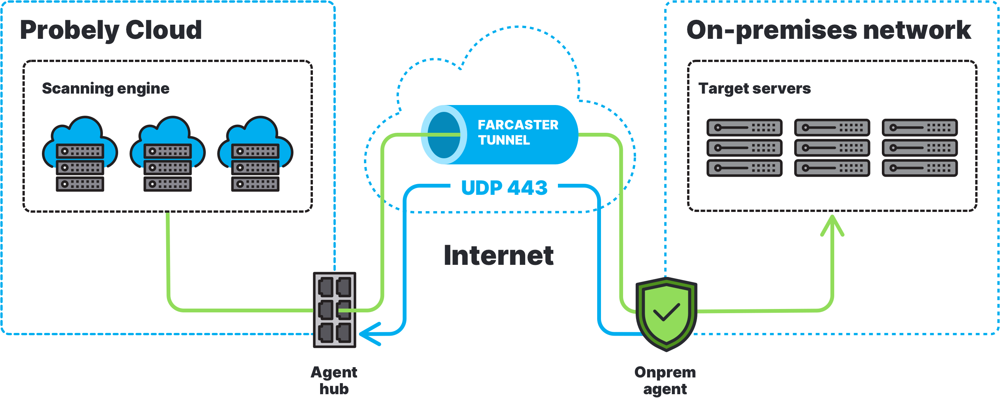

# Overview

This document will guide you through the installation of the Farcaster Agent.

The Farcaster Agent connects Probely to your on-premises network using an encrypted WireGuard
tunnel, allowing Probely to scan your internal applications.

The Agent is open-source, and the code is freely available on the official
[repository](https://github.com/probely/farcaster-onprem-agent).

The following diagram shows an example network topology depicting an on-premises
network, the Agent, the Agent Hub (where on-premises Agents connect to),
and Probely's infrastructure.



# System Resources

The Agent is a Docker container requiring very few resources, as detailed in the following table.

| CPU     | RAM     | Storage     |
| ------- | ------- | ----------- |
| 1       | 512 MB  | 1 GB        |

# Network Requirements

**NOTE**: You do not need to manually add firewall rules on most networks.
Some rules may be required if the agent runs on a network with strict network policies (e.g., all **output** traffic
is denied by default).

To specify a port range, we use the `:` character. For example, `1024:2048`
means: *all ports from 1024 to 2048, inclusive*.

| Name           | Source     | Destination                          | Protocol     | Source Port          | Destination Port |
| -------------- | ---------- | -------------------------------------| ------------ | -------------------- | -------------------- |
| API            | `<agent-ip>`<sup>1</sup> | `api.probely.com`<sup>4</sup>        | `TCP`        | `1024:65535`         | `443`                  |
| Tunnel         | `<agent-ip>` | `54.247.135.113`, `44.212.186.140`          | `UDP`        | `1024:65535`         | `443`                  |
| DNS            | `<agent-ip>` | `<internal-dns-resolvers>`           | `TCP`, `UDP` | `any`                | `53`                   |
| Scan           | `<agent-ip>` | `<target-ip>`<sup>2</sup>          | `TCP`        | `1024:65535`         | `<target-port>`<sup>3</sup>    |
| OOB Vulnerability Check <sup>6</sup> | `<agent-ip>`, `<target-ip>` | `52.17.201.157`, `52.72.180.55`| `TCP` | `1024:65535`                  | `53`, `80`, `443`, `389` |
| OOB Vulnerability Check <sup>6</sup> | `<agent-ip>`, `<target-ip>` | `52.17.201.157`, `52.72.180.55`| `UDP` | `1024:65535`                  | `53` |
| Docker         | `<agent-ip>` | `auth.docker.io`, `registry*.docker.io`<sup>5</sup>     | `TCP`        | `1024:65535`         | `443`        |

Notes:

1. `<agent-ip>` is the internal IP of the machine on your network where Probely's Farcaster Agent is running. It is used by the agent to communicate with the Probely server.
2. `<target-ip>` is the internal IP of your web application. 
If your target is configured to use internal extra-hosts, include their IPs here.
The same goes for the target login URL served by a different internal web application.
3. `<target-port>` is the service port of the server of your web application.
Typical values are 80 and 443.
4. The IP addresses of these hosts are subject to change. We recommend allowing 
web access for the agent VM (HTTP and HTTPS ports). If this is not possible, the agent
will use an HTTP proxy if you set the `HTTP_PROXY` variable.
5. At this time, the hosts are: `registry.docker.io` and `registry-1.docker.io`
6. This server receives connections from potentially vulnerable systems on your infrastructure.
It is used, for example, to detect "Log4Shell"-type vulnerabilities.
   
# Installation

The agent runs on a Docker container. It should work on any system with a Docker installation.

The agent needs an API token to connect to Probely's network.

> If you do not have an agent token, you can create one in the
> [Scanning Agents](https://plus.probely.app/scanning-agents/) management area.

## Required software

Both [Docker](https://docs.docker.com/engine/install/) and
[Docker Compose](https://docs.docker.com/compose/install/) must be installed
for these instructions to work. Please make sure those requirements are met.

### Kubernetes (optional)
We provide an example Agent Kubernetes deployment
[here](https://github.com/probely/farcaster-onprem-agent/tree/main/contrib/kubernetes/).
If you need help setting the Agent up on a Kubernetes cluster, please contact
Probely's support team.

## System checks
* Before installing the agent container, check that your host can run it:
  ```shell
  curl -LO https://raw.githubusercontent.com/Probely/farcaster-onprem-agent/main/farcaster/host-check.sh
  chmod +x host-check.sh
  ./host-check.sh
  ```

  Verify that the checks succeeded:
  ```shell
  Checking if Docker is installed...                              [ok]
  Launching test container...                                     [ok]
  ```

## Launch the agent
* Use the `docker-compose.yml` you saved in **Step 1.** of
 [How to install a Scanning Agent](https://help.probely.com/en/articles/6503388-how-to-install-a-scanning-agent).

* Start the Agent:

  ```shell
  docker-compose up -d
  ```

* Check that the Agent connected successfully

  After starting the Agent, it should link-up with Probely. Run the following command:
  ```shell
  docker logs probely-agent
  ```

  If everything is running correctly, you should see output similar to:
  ```
  Downloading agent configuration ... done
  Deploying agent configuration   ... done
  Starting local DNS resolver     ... done
  Setting HTTP proxy rules        ... done
  Connecting to Probely (via UDP) ... done
  Setting local gateway rules     ... done
  Starting WireGuard gateway      ... done
  
  Running...
  ```

  If the Agent is not connecting to Probely, please ensure that your [firewall](#network-requirements) is properly configured.
  
  Alternatively, the agent can use an HTTP proxy to connect to Probely, if the `HTTP_PROXY` environment variable is set on the `docker-compose.yml` file.  
  While the agent can use an HTTP proxy or a direct TCP connection to Probely, this can cause poor network performance. For more information, see this article about the [TCP Meltdown](https://web.archive.org/web/20220103191127/http://sites.inka.de/bigred/devel/tcp-tcp.html) problem. We **strongly recommend** that you allow the agent to connect to `54.247.135.113` and `44.212.186.140` on `UDP` port `443`.

  Once up and running, the Agent in the Docker container knows the URL or IP of the target to scan from the target configuration in Probely. The Agent communicates with Probely to get this information before starting a scan.  
  Learn more about [how to scan internal applications with a Scanning Agent](https://help.probely.com/en/articles/4615595-how-to-scan-internal-applications-with-a-scanning-agent).

# Building from source

This step is **not** required to run the Agent.

Follow these instructions if you want to understand how the Container is built.

Check out the code from the repository:

```shell
git clone git@github.com:Probely/farcaster-onprem-agent.git
```

**Unless otherwise specified, these instructions must be run on the repository
root.**

```shell
VERSION=local make build-local
```

Remember to reference your custom-built Docker images on the `docker-compose.yml`
file, or Kubernetes pod/deployment manifest you configure. If not specified,
the default Probely docker Agent images are used.

# Security considerations

Installing third-party software on your network requires some degree of trust.
Being security professionals ourselves, we are very aware of this, and designed
Probely following a set of security principles.

**Transparency**

* No black boxes: code and build instructions are open source, with a permissive license.
* You have complete control over the Agent, and can ensure that it has not
been tampered with.

**Least privilege**

* Services are containerized and run with least privileges.
* The Agent is built around
[Zero Trust Networks](https://www.oreilly.com/library/view/zero-trust-networks/9781491962183/)
design principles. All traffic is end-to-end encrypted between agents.
Even inside Probely's "internal" networks.
* The Agent has been hardened in several ways, from using memory-safe languages
(e.g. Go and Rust) to modern, recommended, cryptographic algorithms.
* The Agent does not listen on any public Internet port, reducing its attack
surface.

**Simplicity**

* We believe simplicity enables security.
The Agent follows simple design decisions, and uses modern open-source standard
components, such as [WireGuard](https://www.wireguard.com/).
* The Agent has minimal network requirements. Typical network requirements,
such as public IP addresses and complex firewall rules, are unnecessary or minimized.
* The Agent uses few hardware resources and is designed to scale easily.
