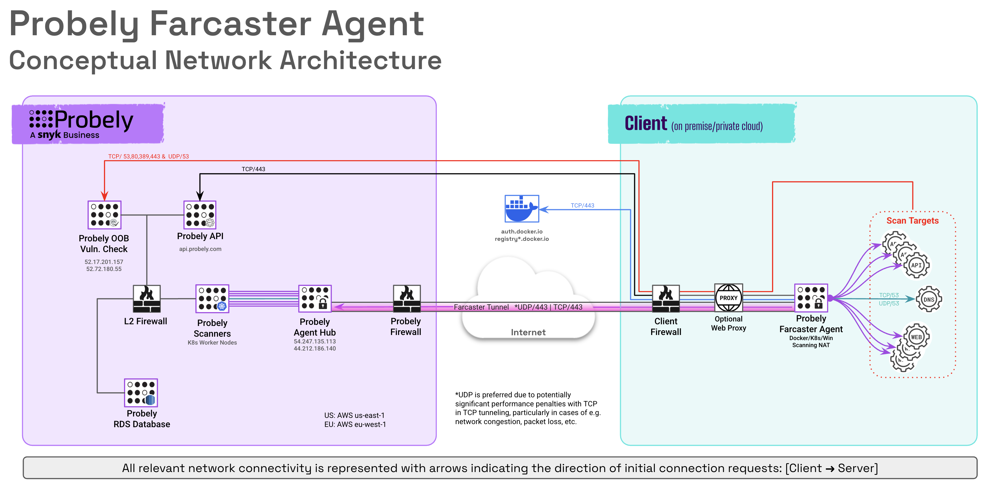

# Overview

This document will guide you through the installation of the Farcaster Agent.

The Farcaster Agent connects Probely to your private networks (i.e. on-premise, private cloud, CICD runner environments, etc.) using an encrypted WireGuard tunnel and proxy, allowing Probely to scan your internal applications with minimal network & security configuration changes.

The Agent is open-source, and the code is freely available on the official
[repository](https://github.com/probely/farcaster-onprem-agent).

# Table of Contents
- [Network Architecture Overview](#network-architecture-overview)
- [System Resources](#system-resources)
- [Network Requirements](#network-requirements)
- [Installation](#installation)
  - [Required software](#required-software)
  - [System checks](#system-checks)
- [Launch the agent](#launch-the-agent)
  - [Configuration Options](#configuration-options)
  - [Additional Windows Options](#additional-windows-options)
  - [Windows Service Control](#windows-service-control)
  - [Troubleshooting](#troubleshooting)

# Network Architecture Overview
The following diagram shows an example network topology for Farcaster agent based
connectivity from a private client network (on-premise, private cloud, CI/CD, etc.) to
the Probely Cloud infrastructure.


  ## Architecture Notes
  1. Client edge security devices (FW, IPS, WAF, etc.) should be configured to whitelist Snyk API & Web Scanner and Asset Discovery service IPs.  Internal security devices (FW, IPS, WAF, etc.) should be configured to whitelist any scanning agent IPs.
  2. Firewall protocol inspection must be disabled for Farcaster Agent connectivity.  TLS Inspection (e.g NGFW or CASB) is not currently supported and should be disabled for Agent connectivity rules in any edge/cloud security devices or services.
  3. If required, Farcaster Agent will support tunnel connectivity via proxy, however performance may be impacted.  
  4. OOB Vulnerability checks are utilized to verify vulnerabilities that allow an attacker to initiate a connection from the target to a remotely controlled ip address / server (e.g. log4shell)
  5. api.probely.com IP addresses may be subject to change, we recommend configuring firewall rules to allow Farcaster  agents outbound https access based on DNS name, or allowing outbound communications to all https destinations.
  6. Private container registries can be utilized if required.

# System Resources

  The Agent is a Docker container requiring minimal resources, as detailed in the following table.

  | CPU     | RAM     | Storage     |
  | ------- | ------- | ----------- |
  | 1       | 512 MB  | 1 GB        |

# Network Requirements

| Name           | Source     | Destination                          | Protocol     | Source Port          | Destination Port |
| -------------- | ---------- | -------------------------------------| ------------ | -------------------- | -------------------- |
| API            | `<agent-ip>`<sup>1</sup> | `api.probely.com`<sup>4</sup>        | `TCP`        | `any`         | `443`                  |
| Tunnel         | `<agent-ip>` | - EU: `54.247.135.113`<br/>- US: `44.212.186.140`<br/>- AU: `54.253.10.194`          | `UDP`        | `any`         | `443`                  |
| DNS            | `<agent-ip>` | `<internal-dns-resolvers>`           | `TCP`, `UDP` | `any`                | `53`                   |
| Scan           | `<agent-ip>` | `<target-ip>`<sup>2</sup>          | `TCP`        | `any`         | `<target-port>`<sup>3</sup>    |
| OOB Vulnerability Check <sup>6</sup> | `<agent-ip>`, `<target-ip>` | - EU: `52.17.201.157`<br/>- US: `52.72.180.55`<br/>- AU: `52.62.50.85`| `TCP` | `any`                  | `53`, `80`, `443`, `389` |
| OOB Vulnerability Check <sup>6</sup> | `<agent-ip>`, `<target-ip>` | - EU: `52.17.201.157`<br/>- US: `52.72.180.55`<br/>-AU: `52.62.50.85`| `UDP` | `any`                  | `53` |
| Docker         | `<agent-ip>` | `auth.docker.io`, `registry*.docker.io`<sup>5</sup>     | `TCP`        | `any`         | `443`        |

Notes:

  1. `<agent-ip>` is the IP address of the machine that the Farcaster Agent is installed on (e.g. the machine running Docker, the Kubernetes proxy IP for the pod, etc.) 
  2. `<target-ip>` is the internal IP of each of your web or API targets. If your target requires authentication via another host or your targets are configured to use extra hosts, include those IPs here as well.
  3. `<target-port>` is the TCP port used to access your web applications & apis on the target host (typically 80, 443, 8080, 8443, etc.)
  4. The IP addresses of these hosts are subject to change. We recommend allowing web access for the agent VM to all external destinations on tcp/443 (https). If this is not possible, the agent will use an HTTP proxy if you set the `HTTP_PROXY` variable.
  5. At this time, the hosts are: `registry.docker.io` and `registry-1.docker.io`
  6. This server receives connections from potentially vulnerable systems on your infrastructure. It is used, for example, to detect "Log4Shell"-type vulnerabilities. These connections are optional, but may impact the ability of Snyk API & Web to verify related vulnerabilitites if the connections are not allowed.

# Installation

  The Farcaster agent can be deployed as a container in Docker or Kubernetes, or as Windows or Linux service.

  The agent needs a token to connect to Probely's network.

  > If you do not have an agent token, you can create one in the
  > [Scanning Agents](https://plus.probely.app/scanning-agents/) management area.

 ## Required software

  ### Docker
  Both [Docker](https://docs.docker.com/engine/install/) and [Docker Compose](https://docs.docker.com/compose/install/) must be installed.

  ### Kubernetes 
   We provide an example Agent Kubernetes deployment [here](https://github.com/probely/farcaster-onprem-agent/tree/main/contrib/kubernetes/).

   If you need help setting the Agent up on a Kubernetes cluster, please contact Probely's support team.

  ### Windows
  Download the latest Window binary from the releases page [here](https://github.com/Probely/farcaster-onprem-agent/releases)

  ### Linux
  Download and compile the source code to run the Farcaster Agent as a service on Linux.
 
 ## System checks
  Before installing the agent container on a Linux system, you can check that your host can run it by executing the following [script](https://raw.githubusercontent.com/Probely/farcaster-onprem-agent/main/farconn/host-check.sh) or run the command below:
  ```shell
  curl -LO https://raw.githubusercontent.com/Probely/farcaster-onprem-agent/main/farconn/host-check.sh
  chmod +x host-check.sh
  ./host-check.sh
```

  Verify that the checks succeeded:

```shell
  Checking if Docker is installed...                              [ok]
  Launching test container...                                     [ok]
```
  
 ## Launch the agent
  * Use the `docker-compose.yml` you saved in **Step 1** of
  [How to install a Scanning Agent](https://help.probely.com/en/articles/6503388-how-to-install-a-scanning-agent).

  * Start the Agent:

```shell
    docker-compose up -d
```

  * Check that the Agent connected successfully

    After starting the Agent, it should link-up with Probely. Run the following command:
```shell
  docker logs probely-agent
```

  If everything is running correctly, you should see output similar to:

```
    Downloading agent configuration ... done
    Deploying agent configuration   ... done
    Starting local DNS resolver     ... done
    Setting HTTP proxy rules        ... done
    Connecting to Probely (via UDP) ... done
    Setting local gateway rules     ... done
    Starting WireGuard gateway      ... done

    Running...
```

  Once up and running, traffic destined for any targets configured to use the agent is routed through the vpn tunnel and proxied by the agent to connect to those targets on your private network. 
  Learn more about [how to scan internal applications with a Scanning Agent](https://help.probely.com/en/articles/4615595-how-to-scan-internal-applications-with-a-scanning-agent).

 ### Configuration Options
   The following configuration options can be set via environment variables when running the agent

  | Required/Optional           | Environment Variable     | Description |
  | -------------- | ---------- | -------------------------------------|
  |  Req   | FARCASTER_AGENT_TOKEN   | Agent API Key                |
  |  Opt   | FARCASTER_API_URL                 | url of API server                |
  |  Opt   | FARCASTER_DEBUG_LEVEL          | Logging level 0, 1, or 2               |
  |  Opt   | FARCASTER_FORCE_TCP                 | TRUE, Skip UDP connectivity                |
  |  Opt   | FARCASTER_SKIP_CERT_VERIFY          | TRUE, Skip Certificate verification for testing HTTPS inspection (FW, CASB, etc.)                |
  |  Opt   | HTTP_PROXY                    | Use the configured proxy address for all connections                |

 ### Additional Windows Options
  The Farcaster Agent can be run standalone or installed as a service in Windows, and controlled via environment variables or using the following command line switches as follows: 

    farcasterd -t <agent token> [optional switches]

  | Required/Optional           | Switch    | Descrription |
  | -------------- | ---------- | -------------------------------------|
  | Req | -t, --token string     | Authentication token. Can either be the path to the token file, or the token itself
  | Opt |   --api-url string     | Override the default API URL
  | Opt |   --check-token        | Check if the token is valid and exit 
  | Opt |   --control string     | Enable the control API on the Windows named pipe
  | Opt |   -d, --debug          | Enable debug logging
  | Opt |    --group string      | Group to grant access to the control API
  | Opt |   --help               | help for farcasterd
  | Opt |   --ipv6               | Enable IPv6/AAAA DNS query resolution
  | Opt |   -l, --log string     | Log file path. Log to stderr if not specified
  | Opt |   --proxy-names        | Use hostnames instead of IPs in proxy CONNECT/SOCKS5 requests
  | Opt |   -v, --version        | Print the version and exit

 #### Windows Service Control
    farcasterd service install -t [Agent token]   Install Farcasterd Service
    farcasterd servive start | stop               Start or Stop Farcasterd Service
    farcasterd service remove                     Uninstall Farcasterd Service  


# Troubleshooting
  Connection issues typically fall into one or more of the following categories:

  ### Unable to download Agent configuration
  - Ensure the host system can resolve api.probely.com and connect via https using e.g. curl or chrome.
  - Check to ensure proxy settings are not required for Agent connectivity.
  - CASB / HTTPS inpection capabilitites which intercept the HTTPS connection for decode will result 
      in the Agent being unable to verify the api.probely.com tls cerfificate.  We recommend configuring the 
      device / service performing HTTPS interception to allow the Farcaster Agent to connect directly to 
      api.probely.com and the Farcaster hub, if that is not possible, tls cert verification can be disabled with 
      the FARCASTER_SKIP_CERT_VERIFY=TRUE environment variable.

  ### Unable to connect (UDP/443 or UDP & TCP/443)
  - If firewalls are not permitting UDP/443 outbound from the agent to the appropriate Farcaster hub, as well as the appropriate return traffic, the connection will fall back to TCP/443 and the agent will show "Connected with Issues" in the Snyk API & Web UI.   
  - If firewalls are not permitting UDP/443 OR TCP/443 from the Agent to the Farcaster hub the agent will not be able to connect.
  - In some cases protocol level firewall rules (e.g allow HTTPS protocol ONLY over TCP/443, allow QUIC prorocol ONLY over UDP/443, or allow "Standard Protocols only") the initial UDP connection or the initial TCP handshake will be successful, but subsequent communications will be blocked as the traffic is not using standard protocols.  Protocol based rules should be disabled or set to allow the protocol identified by the firewall (typically wireguard) for Agent communications.

  Please refer to [network requirements](#network-requirements) for Agent connectivity requirements.

  ### Proxy Configuration 
  The agent can use a proxy to connect to Probely using standard environment variables. The agent honors `HTTP_PROXY`, `HTTPS_PROXY`, and `NO_PROXY` for outbound connections. HTTPS proxies are supported. `ALL_PROXY` is honored for WebSocket connections (ws://, wss://) via the standard library HTTP transport, but not for raw TCP connections.

  ### Performance Issues
While the agent can use an HTTP/S proxy or a direct TCP connection to Probely, this can cause poor network performance. For more information, see this article about the [TCP Meltdown](https://web.archive.org/web/20220103191127/http://sites.inka.de/bigred/devel/tcp-tcp.html) problem. We **strongly recommend** that you allow the agent to connect to `54.247.135.113`,  `44.212.186.140`, and `54.253.10.194` on `UDP` port `443`.

  ### UDP Connectivity testing
 To confirm if nothing is blocking the UDP connections, you can set up a UDP server using the following script **outside your network** to "echo" the received messages:

```python
import socket

def udp_server(host='0.0.0.0', port=12345):
    sock = socket.socket(socket.AF_INET, socket.SOCK_DGRAM)
    sock.bind((host, port))
    print(f"UDP server listening on {host}:{port}")

    while True:
        data, client_address = sock.recvfrom(1024)
        print(f"Received message from {client_address}: {data.decode()}")
        response = f"Received your message: {data.decode()}"
        sock.sendto(response.encode(), client_address)

if __name__ == "__main__":
    udp_server()
```

And test it with:

```shell
$ echo "AAAAAA" | nc -w 3 -u xx.xx.xx.xx 12345
Received your message: AAAAAA
```

You should test large messages:

```shell
$ python3 -c 'print("A"*2000)' | nc -w 3 -u xx.xx.xx.xx 12345
Received your message: AAAAAAAAAAAAAAAAAAAAAAAAAAAAAAAAAAAAAAAAAAAAAAAAAAAAAAAAA....
```


# Building from source

This step is **not** required to run the Agent.

Follow these instructions if you want to understand how the Container is built.

Check out the code from the repository:

```shell
git clone git@github.com:Probely/farcaster-onprem-agent.git
```

**Unless otherwise specified, these instructions must be run on the repository
root.**

```shell
VERSION=0.0.0 make build-local
```
# Container Images
Remember to reference your custom-built Docker images in your docker command, in your `docker-compose.yml`
file,  or Kubernetes pod/deployment manifest.  If not specified,
the default Probely docker Agent images are used.  Internal repositories can be used by pushing the appropriate images and modifying docker, docker compose, or Kubernetes manifests appropriately.

# Security considerations

Installing third-party software on your network requires some degree of trust.
Being security professionals ourselves, we are very aware of this and designed
Probely following a set of security principles.

**Transparency**

* No black boxes: code and build instructions are open source, with a permissive license.
* You have complete control over the Agent and can ensure it has not
been tampered with.

**Least privilege**

* Services are containerized and run with least privileges.
* The Agent is built around
[Zero Trust Networks](https://www.oreilly.com/library/view/zero-trust-networks/9781491962183/)
design principles. All traffic is end-to-end encrypted between agents.
Even inside Probely's "internal" networks.
* The Agent has been hardened in several ways, from using memory-safe languages
(e.g., Go and Rust) to modern, recommended cryptographic algorithms.
* The Agent does not listen on any public Internet port, reducing its attack
surface.

**Simplicity**

* We believe simplicity enables security.
The Agent follows simple design decisions and uses modern open-source standard
components, such as [WireGuard](https://www.wireguard.com/).
* The Agent has minimal network requirements. Typical network requirements,
such as public IP addresses and complex firewall rules, are unnecessary or minimized.
* The Agent uses few hardware resources and is designed to scale easily.

**Internal Firewalling**

The agent may be installed in e.g. a partner DMZ or other firwalled segment to allow complete client control of the targets that can be accessed from the Agent, however, please keep in mind rules must allow connectivity for all Snyk API & Web targets, as well as any ancillary services and hosts required by those web apps and APIs.

